  

<h1 align="center">👾 Welcome to my GitHub 👾</h1>

  
  
  
  
  

## 👽 About me

- 🏢 Infrastructure, DevOps and security at **Green IT Solutions**
- 🖥️ I build and run virtualization and distributed storage platforms: **Proxmox VE**, **Ceph**, **Debian**
- 🤖 I automate what can be automated, and write the tooling I miss along the way
- 🛡️ Offensive security: I attack the infrastructure I build to check that it holds
- ♟️ Chess enthusiast
- 🎧 Music, machine learning and low level systems on the side

## 🚀 Projects

| Project | Description |
| :-- | :-- |
| **[pvecli](https://github.com/Helphyy/pvecli)** | A modern, interactive CLI for managing Proxmox VE clusters |
| **[claudock](https://github.com/Helphyy/claudock)** | Secure containerized wrapper for Claude Code: persistent containers, multi-profile auth, layered images |
| **[Simple-SSO](https://github.com/Helphyy/Simple-SSO)** | The simplest self-hosted OIDC SSO: one `docker compose up`, SQLite, zero external deps |
| **[debforge](https://github.com/Helphyy/debforge)** | Custom Debian image building |
| **[HornetPath](https://github.com/Helphyy/HornetPath)** | Work in progress |

  Badges powered by <a href="https://shields.io">Shields</a> · Icons by <a href="https://simpleicons.org">Simple Icons</a>

